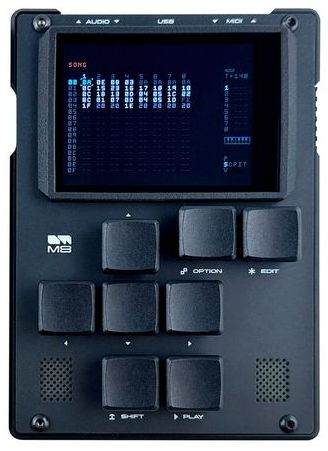
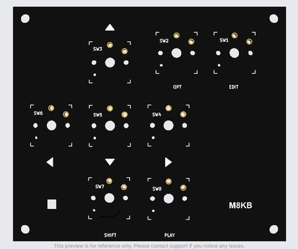
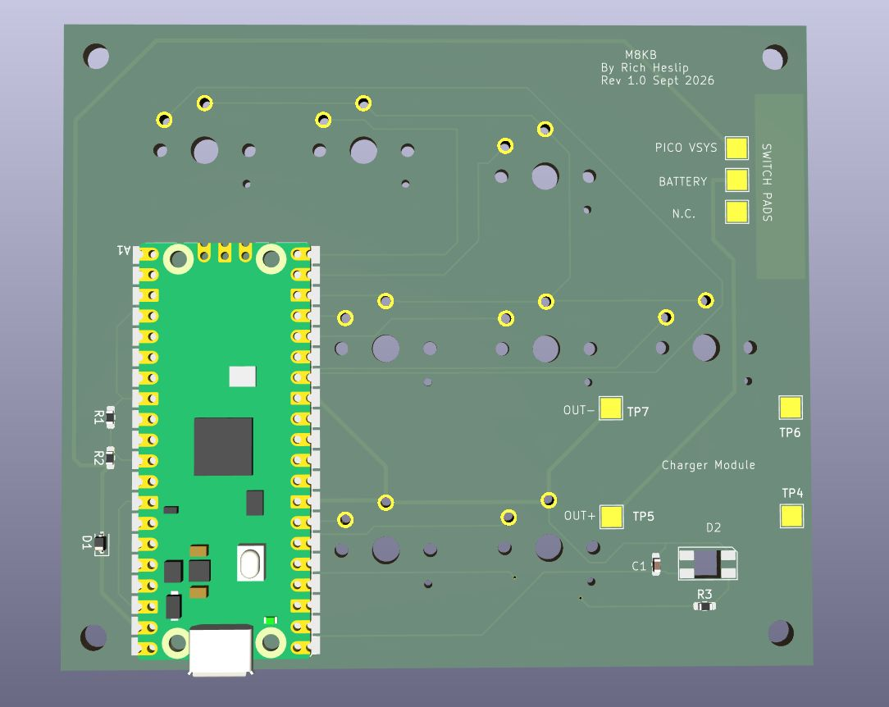
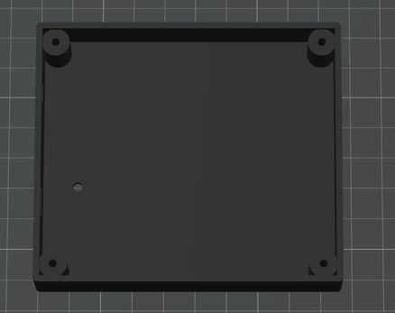
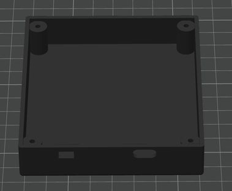
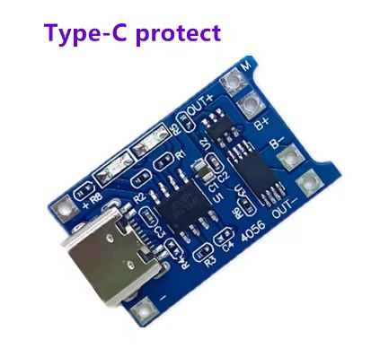

**BLE Wireless Keyboard for the M8 iOS App**

When I saw that Dirtywave had released an M8 app on iOS one my first thoughts was to make an M8 like keyboard for it. I have an M8 headless that is almost identical to the real M8 and I wanted to leverage the muscle memory I had developed for that.

The prototype worked very well so I have designed a PCB and enclosure which more or less duplicates the M8 V1 design - eight Kailh switches, approx 97mm x 84mm x18mm, white silkscreen. It has a small RGB led for indicating battery status, pads for a switch and pads for a lipo charger module as well.

 
 
  
 
 3D Renders of the enclosure. Note the cutouts for USB-C charging jack and switch. 

  
 
   
  
  
Batteries

I use LiPo batteries and small charger modules from AliExpress. The PCB footprint is for this one which has a LiPo protection circuit as well but you can barnacle almost any of these on and make it work.

 

 
**CAUTION this TP4056 charger module is set up for 1A charge rate which is too high for most small LiPo's** 
To be safe you will want to change the current setting resistor to something like 1/3 of the battery capacity.

**LiPo batteries are a fire hazard!!! Do not use a LiPo unless you are comfortable modifying the module appropriately, testing it, and are willing to take the risk**

Alternatively use 3 AAA batteries which is much safer. You can use 2x AAA as well but the battery life will be reduced by 1/3.
The battery indicator is set up for the range of a LiPo 4.2V full, 3V cutoff which is about the same voltage range as three AAA. If you use something else you will need to modify the sketch.

Power consumption of the Pico 2 W running this sketch is around 40ma at 5V (0.2 watts). If you use three AAA alkalines (around 3WH) the batteries should last around 15 hours. An 800 Mah LiPo should have about the save battery life.
Unfortunately the Pico 2 BLE stack does not support power management or underclocking which would have been nice to extend the battery life.

Assembly

Solder the three 0603 resistors, the .1u cap and the schottky diode. Solder in the RGB LED making sure that the orientation matches the silkscreen and make sure the lens is facing the FRONT of the PCB. If you don't want to source this LED, you can barnacle an SMT LED or even a 3mm LED to the pads but you will have to modify the sketch to make in blink or something when the battery is low.

Solder the Pico 2W to the pads. 
If you think you may want to remove it at some point best to use small wires or perhaps put some kapton tape on the bottom of the Pico - if the pads have been soldered directly to the PCB pads its very hard to desolder. Also make sure the USB connector edge is flush with the PCB edge - you don't want it to stick out because there is no provision for it in the enclosure. ie load the firmware with the board out of the enclosure.

Solder in the Kailh 1350 switches so the plungers are on the front side of the PCB (obviously). These switches are the same ones used on the M8 and they are available with different actuation forces and "clickiness". The M8 has removable switches - I had the sockets in the design and then took them out. M8 users probably already know which switches they like.

If you are using a LiPo, solder the charger module to the four pads so the USB jack faces to the left with the board switch side up. If you are using a AAA holder, solder the +ve lead to the OUT+ pad and the -ve lead to OUT- pad. A 3x AAA battery holder should just fit between the Pico and the charger pads and can be stuck to the PCB with double sided foam tape. 

If you are using a LiPo, solder the negative battery lead to the B- pad on the charger module. At this point its a very good idea to put a current meter between the B+ pad and the battery + lead and make sure the power switch is off. If everything is OK there should be just a very tiny leakage current. If not, you probably have a bad module. I always check the charging current at this stage as well.

I couldn't find a suitable PCB mounted R/A slide switch so I went with PCB pads so you can solder in whatever you have. I use small slide switches about 5mm thick by 13mm wide. Glue it to the PCB and wire the switch leads to the provided pads. Make sure the switch is flush with the edge of the PCB and aligned with the switch cutout in the enclosure.

The mounting holes in the enclosure are sized for 4-40 or 3mm screws - tap the holes. You could also use small wood or plastic cutting screws.

Sept 15/2026 - initial version of the code - **still needs to be modified for the PCB version of M8KB**

Sept 17/2026 - added hardware design files for PCB and enclosure **NOT TESTED YET - still awaiting PCBs from JLCPCB**